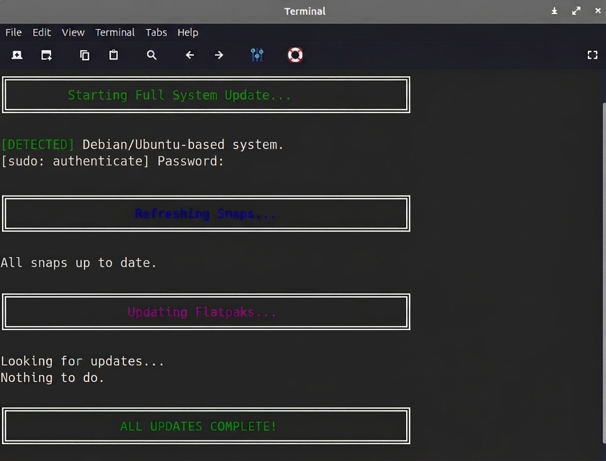

# Linux-updater 🚀 (`upall`)

> **`upall`** is an intelligent, multi-distribution system updater script for Linux. It automatically adapts to your operating system, core package manager, and installed containerized platforms to update your entire machine with a single command.


<p align="center">
  
</p>


## 🌟 Overview

While this project is named **Linux-updator** on GitHub, it installs a global terminal command called **`upall`**. 

Instead of manually running multiple update commands for your system packages, Flatpaks, and Snaps, you just type `upall` and let the script handle the heavy lifting safely and cleanly.


---

## ✨ Features

- **Auto-Detects OS Base:** Automatically switches its logic between Debian/Ubuntu (`apt`) and Arch Linux (`pacman`).
- **AUR Helper Support:** If you are on an Arch-based system, it dynamically detects and utilizes `yay` or `paru` to update your Arch User Repository packages automatically.
- **Smart Container Skipping:** It checks if `snap` or `flatpak` are actually installed *before* displaying headers or running commands. If your system doesn't use them, the script stays silent—no clutter, no "command not found" errors.
- **Clean & Beautiful Interface:** Formatted with custom ASCII box boundaries, explicit color coding, and neat terminal vertical spacing so you can easily track update progress.


---

## 🚀 How to Install Using the Lazy Installer script (Recommended)

The easiest way to install `upall` globally on your system is to use the lazy installer script. This will automatically check your OS, install dependencies like `curl` if they are missing, download `upall`, and make it usable from anywhere.

### Option A: The One-Line Express Installation
Open your terminal and paste this single command:

``` Bash
curl -sL [https://raw.githubusercontent.com/cybermaxpower/linux-updator/main/install.sh](https://raw.githubusercontent.com/cybermaxpower/linux-updator/main/install.sh) | bash
```

### Option B: Manual Step-by-Step Installation
If you prefer to download the installer file first, run these commands:

``` Bash
 1. Download the installer script
curl -O [https://raw.githubusercontent.com/cybermaxpower/linux-updator/main/install.sh](https://raw.githubusercontent.com/cybermaxpower/linux-updator/main/install.sh)

 2. Make the installer executable
chmod +x install.sh

 3. Run the installer
./install.sh
```

---

## 💻 How to Use `upall` in the Terminal

Once installed, using the application is incredibly straightforward. It acts just like a native system command.

### Running the App
Open your terminal from anywhere on your system and simply type:

```bash
upall
```

## What to Expect When Run:
Screen Refresh: The script starts by clearing your terminal view for a clean, professional workspace.

Privilege Elevation: You will see a standard [sudo] password prompt. This is completely safe and required so your system package managers can look for updates.

Environment Sync: A banner will output telling you exactly what type of machine it detected (e.g., [DETECTED] Arch-based system).

Sequential Processing: It runs through your core system updates first, then smoothly moves on to Snaps and Flatpaks only if they are active on your computer.

Completion Graphic: A prominent success block drops down at the very end to signal your entire machine is fully updated and secure.
