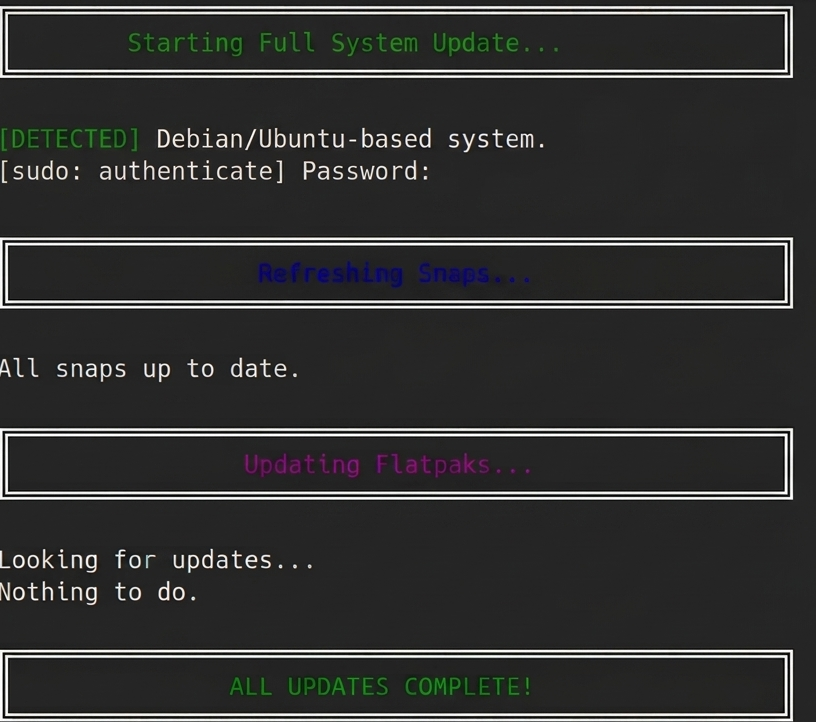

# upall 🚀
> Update everything at once. **upall** automates system package, Flatpak, and Snap updates with a single, clean terminal command.d.
> 

<p align="center">


</p>

## 🌟 Overview
​Updating system packages, Flatpaks, and Snaps one by one is repetitive. upall fixes that by providing a single, global terminal command to keep your entire Linux ecosystem up to date—safely, cleanly, and without hassle.

* ​One Command: Just type upall and walk away.
* ​Comprehensive Updates: Covers system package managers, Flatpaks, and Snaps in one run.

*​ Safe Execution: Designed to perform updates cleanly without cluttering your shell output..

## 💡 Why This Project Exists
I created **upall** because keeping a modern Linux system updated can be annoying.
Today, a single computer often uses **different package ecosystems** at the same time. To fully update your system, you usually have to remember and type several separate commands:
 * sudo apt update && sudo apt upgrade (for system packages)
 * sudo snap refresh (for Snap applications)
 * flatpak update (for Flatpak applications)
I wanted script **single, universal command** that could handle everything for me.
This script does the remembering for you. It scans your system, finds what needs updating, and runs all the correct commands in order. It saves time and ensures your machine is always completely secure with just one word: upall.

## ✨ Features
 * **Auto-Detects OS Base:** Automatically switches its logic between Debian/Ubuntu (apt) and Arch Linux (pacman).
 * **AUR Helper Support:** If you are on an Arch-based system, it dynamically detects and utilizes yay or paru to update your Arch User Repository packages automatically.
 * **Smart Container Skipping:** It checks if snap or flatpak are actually installed *before* displaying headers or running commands. If your system doesn't use them, the script stays silent—no clutter, no "command not found" errors.
 * **Clean & Beautiful Interface:** Formatted with custom ASCII box boundaries, explicit color coding, and neat terminal vertical spacing so you can easily track update progress.
## 🚀 How to Install Using the Lazy Installer script (Recommended)
The easiest way to install upall globally on your system is to use the lazy installer script. This will automatically check your OS, install dependencies like curl if they are missing, download upall, and make it usable from anywhere.
### Option A: The One-Line Express Installation
Open your terminal and paste this single command to install instantly:
```bash
curl -sL https://raw.githubusercontent.com/cybermaxpower/upall/main/install.sh | bash


```
### Option B: Manual Step-by-Step Installation
If you prefer to download the installer file first, run these commands:
```bash
# 1. Download the installer script
curl https://raw.githubusercontent.com/cybermaxpower/upall/main/install.sh

# 2. Make the installer executable
chmod +x install.sh

# 3. Run the installer
./install.sh

```
## 💻 How to Use upall in the Terminal
Once installed, using the application is incredibly straightforward. It acts just like a native system command.
### Running the App
Open your terminal from anywhere on your system and simply type:
```bash
upall

```

## What to Expect When Run:
 * **Screen Refresh:** The script starts by clearing your terminal view for a clprofessionalional workspace.
 * **Privilege Elevation:** You will see the secure password prompt required so your core system package managers can look for updates safely.
 * **Environment Sync:** A banner will output telling you exactly what type of machine it detected (e.g., [DETECTED] Arch-based system).
 * **Sequential Processing:** It runs through your core system updates first, then smoothly moves on to Snaps and Flatpaks *only* if they are active on your computer.
 * **Completion Graphic:** A prominent success block drops down at the very end to signal your entire machine is fully updated and secure.

## 🔒 Why It Asks for Your Password (sudo)
When the script starts, you will see a standard [sudo] password prompt.
 * **It is completely safe.**
 * Your system requires **administrator privileges (sudo)** to safely download, install, and replace core system files.
 * You only need to type your password **once** at the beginning. The script will remember it until all updates are finished.
 

---

## ⚖️ Warranty & Liability Disclaimer

### NO WARRANTY (PROVIDED "AS IS")
This software is provided completely **"as is"** without any warranty of any kind, either expressed or implied. 

### Limitation of Liability
* **Use at Your Own Risk:** The developer is not liable for any system instability, package conflicts, data loss, or system issues that may occur on your computer from installing, running, or updating software using this tool. 
* **User Responsibility:** Automatic cleanups (such as removing unused Flatpak runtimes) can modify local configurations or environment setups linked to those packages. It is your absolute responsibility to inspect the script, review what is being changed or deleted, and maintain your own system backups before executing updates.


